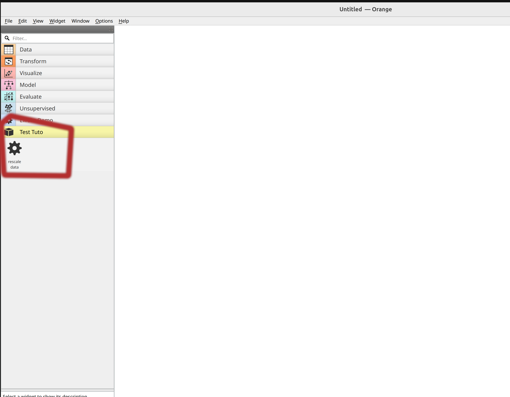
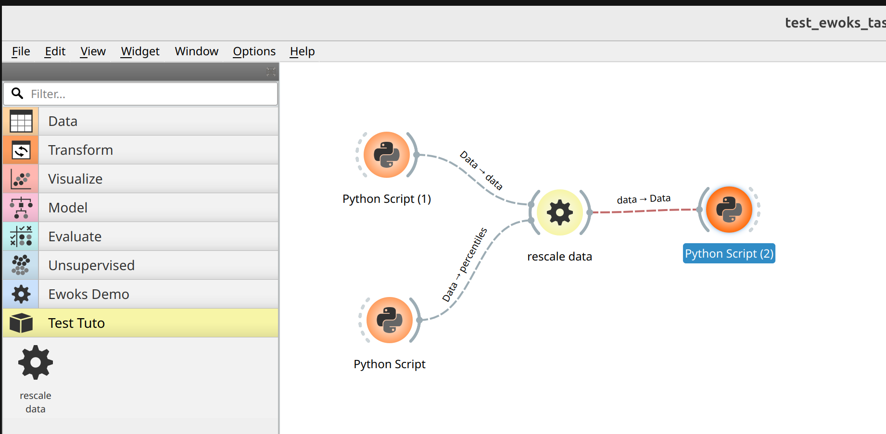

My first orange widget for ewoks
================================

In this tutorial we will explain you how to create your first orange widget for an ewoks task.

.. important::

     prerequisites: we consider that you are already fluent in python and experienced with ewoks and qt concepts.

Setting up ewoksorange
----------------------

Please make sure you already have `ewoksorange` install on your python environment. Else please see `installation`

Defining an ewoks task
----------------------

For this tutorial we would like to add a dedicated interface for the a task performing some data clipping from percentiles.
We already have implemented it with `ewokscore <https://gitlab.esrf.fr/workflow/ewoks/ewokscore>`_.

.. code-block:: python

    from ewokscore.task import Task
    import numpy

    class ClipDataTask(
        Task,
        input_names=["data", "percentiles"],
        output_names=["data"],
    ):
        """
        Task to rescale 'data' (numpy array) to the given percentiles.
        """

        def run(self):
            data = self.inputs.data
            # compute data min and max
            percentiles = self.inputs.percentiles
            assert isinstance(percentiles, tuple) and len(percentiles) == 2, "incoherent input"
            assert percentiles[0] <= percentiles[1], "incoherent percentiles value"

            self.outputs.data = numpy.clip(
                data,
                a_min=numpy.percentile(data, percentiles[0]),
                a_max=numpy.percentile(data, percentiles[1]),
            )

Associate a task to a dedicated orange widget
---------------------------------------------

Now we want to create a widget that will display the values of the percentiles range received.

For this we want to use the two user friendly sliders using `QSlider <https://doc.qt.io/qt-6/qslider.html>`_ (one for each percentiles)

The behavior will be the following:

* when the 'percentiles' inputs arrive it will update the sliders
* when the data arrives it will execute the task and provide 'data' to the next widget

There is different ways to define the ewoks tasks execution with orange (see :ref:`Ewoks widgets and execution`).

On this example we will take the ewoks widget doing the processing in a single thread (:ref:`design single thread no stack (OWEwoksWidgetOneThread)`).
Because this will make sure the gui will not freeze with it and we don't need concurrent execution.

Widget 'skeleton' is the following:

.. code-block:: python
    :linenos:

    class ClipDataOW(
        OWEwoksWidgetOneThread,
        ewokstaskclass=ClipDataTask,
    ):
        name = "rescale data"
        id = "orange.widgets.my_project.ClipDataTask"
        description = (
            "widget to clip data (numpy array) within a percentile range."
        )
        pass

.. hint::

    * l1: OW stand for Orange Widget
    * l2: inheritance with the ewoks orange widget
    * l3: definition of the ewoks task to bind. This is usually given with the full module path. For example if `RescaleDataTask` is saved in `my_project.tasks.rescale` the value would be `my_project.tasks.rescale.RescaleDataTask`
    * l5: the name of the widget (will be displayed in the canvas)
    * l6: id from the orange point of view. It should be constant with time to make insure workflow compatibility. 
    * l7: tooltip of the widget

How to test this first widget ?
~~~~~~~~~~~~~~~~~~~~~~~~~~~~~~~

Including the code in an orangecontrib section
^^^^^^^^^^^^^^^^^^^^^^^^^^^^^^^^^^^^^^^^^^^^^^

Orange offers a mechanism to include widget to the orange canvas. For this your library must offer an 'orangecontrib' module.
For this you can refer to the :ref:`Starting a new project from scratch` chapter.

If your project is correctly configured you should see the widget appearing:

.. note:: in this example we have an empty project with orange installed. The `RescaleDataOW` has been added in a `Test Tuto` orangecontrib.

.. hint:: 

    `ewoks-canvas` is automatically launching the widget discovery. If you are using orange-canvas instead you might need to use the `--force-discovery` option.

.. warning::

    each Orange widget should be in a dedicated file. Else orange parsing will fail.

Test it with 'python script' widget
^^^^^^^^^^^^^^^^^^^^^^^^^^^^^^^^^^^

`Orange3 <https://orangedatamining.com/>`_ package offers the 'python script' widget which are very convenient for testing.

Make sure you have Orange3 installed:

.. code:: bash
    pip install Orange3

Then you will be able to create a workflow like

Now we can provide the task inputs from the two widgets 'input_data' and 'input_percentiles' and print the output data from `output_data` widget.
Here is the source code we will used in each of the widgets:

.. tab-set::

    .. tab-item:: `input_data` widget

        .. code-block:: python
            
            import numpy
            # generate a numpy array with values between 0.0 to 1.0
            out_object = numpy.random.random(size=10000).reshape(100, 100)
            print("input data min is", out_data.min())
            print("input data max is", out_data.max())

    .. tab-item:: `input_percentiles` widget

        .. code-block:: python

            out_object = (10, 90)

    .. tab-item:: `output_data` widget

        .. code-block:: python

            print("output data min is", in_data.min())
            print("output data max is", in_data.max())

when running the first two python widget we get:

.. code-block:: bash

    Running script:
    output data min is 0.10002332932732391
    output data max is 0.9068068838817003

If you have a close result then you can move to the next section.