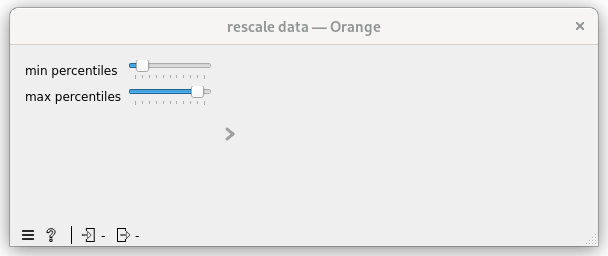
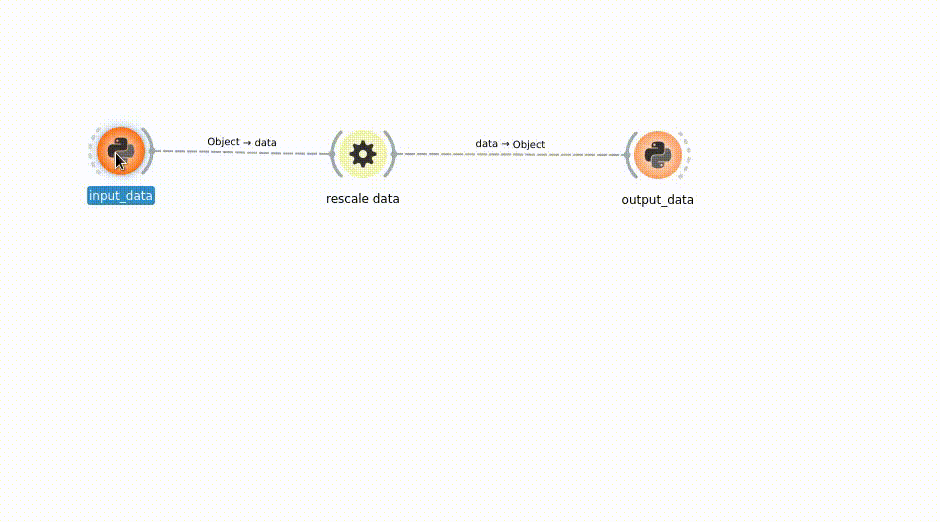

.. _tuto_first_widget_output_feedback:

Provide feedback on task output
===============================

We just saw :ref:`tuto_first_widget_how_to_get_input_from_gui` we now want to display the result of the task.

For this we can:

* add a plot widget to the 'ClipDataOW' that displays the histogram of values in 'data' in the [0.0, 1.0] range
* update the plot widget when ewoks task output changes.

First let's move the 'MyWidget' to the control area

From orange main area to control area
"""""""""""""""""""""""""""""""""""""

.. code-block:: diff

    diff --git a/src/orangecontrib/testtuto/ClipDataOW.py b/src/orangecontrib/testtuto/ClipDataOW.py
    index 131e5da..606e74d 100644
    --- a/src/orangecontrib/testtuto/ClipDataOW.py
    +++ b/src/orangecontrib/testtuto/ClipDataOW.py
    @@ -40,7 +40,7 @@ class ClipDataOW(
        id = "orange.widgets.my_project.ClipDataTask"
        description = "widget to clip data (numpy array) within a percentile range."
        want_main_area = True
    -    want_control_area = False
    +    want_control_area = True
    
        _ewoks_inputs_to_hide_from_orange = ("percentiles", )
    
    @@ -48,7 +48,7 @@ class ClipDataOW(
            super().__init__(parent)
    
            self._myWidget = MyWidget(self)
    -        self.mainArea.layout().addWidget(self._myWidget)
    +        self.controlArea.layout().addWidget(self._myWidget)
    
            # set up percentiles
            self._myWidget.setPercentiles((10, 90))

Now the widget will looks like:

Adding a plot to the OrangeWidget
"""""""""""""""""""""""""""""""""

.. code-block:: python
    :linenos:

    class ClipDataOW(
        OWEwoksWidgetOneThread,
        ewokstaskclass=ClipDataTask,
    ):
        name = "rescale data"
        id = "orange.widgets.my_project.ClipDataTask"
        description = "widget to clip data (numpy array) within a percentile range."
        want_main_area = True
        want_control_area = True

        _ewoks_inputs_to_hide_from_orange = ("percentiles", )

        def __init__(self, parent=None):
            super().__init__(parent)

            self._plot = Plot1D(self)
            self.mainArea.layout().addWidget(self._plot)
            self._myWidget = MyWidget(self)
            self.controlArea.layout().addWidget(self._myWidget)

            # set up percentiles
            self._myWidget.setPercentiles((10, 90))
            self._percentileChanged()

            # connect signal / slot
            self._myWidget._minPercentiles.valueChanged.connect(self._percentileChanged)
            self._myWidget._maxPercentiles.valueChanged.connect(self._percentileChanged)

        def _percentileChanged(self):
            self.set_dynamic_input("percentiles", self._myWidget.getPercentiles())
            data = self.get_task_output_value("data")
            if not is_missing_data(data):
                self.execute_ewoks_task()
        
        def task_output_changed(self):
            data = self.get_task_output_value("data")
            if is_missing_data(data):
                self._plot.clear()
            else:
                # compute histogram
                histogram, _ = numpy.histogram(data, bins=100, range=(0.0, 1.0))
                self._plot.addCurve(x=numpy.linspace(0.0, 1.0, num=100), y=histogram, legend="histogram")
            return super().task_output_changed()

.. hint::

    * l16-17\: add a silx Plot1D widget and add it to the control area
    * l23\: make sure the 'percentiles' is defined at start
    * l31-33\: `percentiles` input will now be defined before `data` input (l23). So let's make sure `data` is defined before processing the ewoks task.
    * l35-43\: `task_output_changed` is called once the ewoks task has been processing:

        * If the task failed we clear the plot (l37-38)
        * Else we compute the histogram and display it.

Now your processing should looks like:

.. hint:: You can hide some input(s) you can also hide some output(s) using the `_ewoks_outputs_to_hide_from_orange` class attribute.

