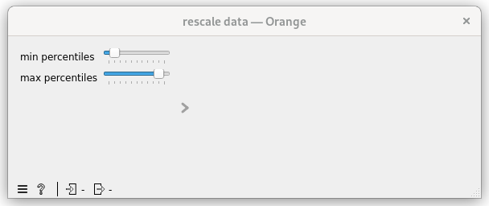
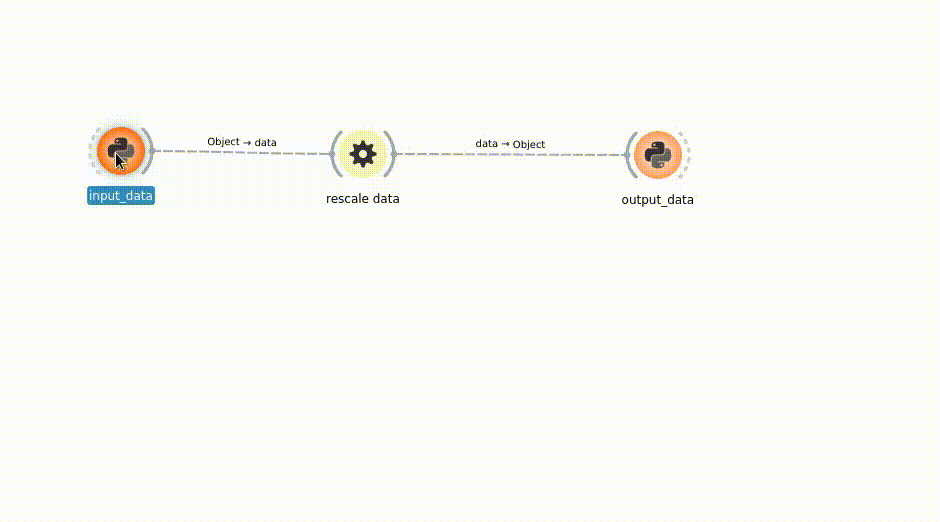

.. _tuto_first_widget_output_feedback:

Provide feedback on task output
===============================

In this chapter we will:

* add a plot widget to 'OWClipData' that displays histogram values of 'data' in [0.0, 1.0]
* update the plot widget when ewoks task output changes.

First let's move the 'MyWidget' to the control area

From orange main area to control area
"""""""""""""""""""""""""""""""""""""

.. comment::

    The following code-block is only a subset of the full diff. This is why it is displayed in raw format.

.. code-block:: diff

    diff --git a/src/orangecontrib/testtuto/OWClipData.py b/src/orangecontrib/testtuto/OWClipData.py
    index 131e5da..606e74d 100644
    --- a/src/orangecontrib/testtuto/OWClipData.py
    +++ b/src/orangecontrib/testtuto/OWClipData.py
    @@ -40,7 +40,7 @@ class OWClipData(
        id = "orange.widgets.my_project.ClipDataTask"
        description = "widget to clip data (numpy array) within a percentile range."
        want_main_area = True
    -    want_control_area = False
    +    want_control_area = True
    
        _ewoks_inputs_to_hide_from_orange = ("percentiles", )
    
    @@ -48,7 +48,7 @@ class OWClipData(
            super().__init__(parent)
    
            self._myWidget = MyWidget(self)
    -        self.mainArea.layout().addWidget(self._myWidget)
    +        self.controlArea.layout().addWidget(self._myWidget)
    
            # set up percentiles
            self._myWidget.setPercentiles((10, 90))

Now the widget will looks like:

Adding a plot to the OrangeWidget
"""""""""""""""""""""""""""""""""

.. code-block:: python
    :linenos:

    class OWClipData(
        OWEwoksWidgetOneThread,
        ewokstaskclass=ClipDataTask,
    ):
        name = "rescale data"
        id = "orange.widgets.my_project.ClipDataTask"
        description = "widget to clip data (numpy array) within a percentile range."
        want_main_area = True
        want_control_area = True

        _ewoks_inputs_to_hide_from_orange = ("percentiles", )

        def __init__(self, parent=None):
            super().__init__(parent)

            self._data = None

            self._plot = Plot1D(self)
            self.mainArea.layout().addWidget(self._plot)
            self._myWidget = MyWidget(self)
            self.controlArea.layout().addWidget(self._myWidget)

            # set up percentiles
            self._myWidget.setPercentiles((10, 90))
            self._percentileChanged()

            # connect signal / slot
            self.task_executor.finished.connect(self._task_finished)
            self._myWidget._minPercentiles.valueChanged.connect(self._percentileChanged)
            self._myWidget._maxPercentiles.valueChanged.connect(self._percentileChanged)

        def _percentileChanged(self):
            self.set_dynamic_input("percentiles", self._myWidget.getPercentiles())
            if self._data is not None:
                self.execute_ewoks_task()

        def _task_finished(self, task_future: TaskFuture):
            # The future is only handed to us here, so keep what the rest of the
            # widget needs later on.
            self._data = None
            if task_future.succeeded():
                data = task_future.output_values()["data"]
                if not is_missing_data(data):
                    self._data = data

            if self._data is None:
                self._plot.clear()
            else:
                # compute histogram
                histogram, _ = numpy.histogram(self._data, bins=100, range=(0.0, 1.0))
                self._plot.addCurve(x=numpy.linspace(0.0, 1.0, num=100), y=histogram, legend="histogram")

.. hint::

    * l18-19\: add a silx Plot1D widget and add it to the control area
    * l24\: make sure the 'percentiles' is defined at start
    * l32-35\: `percentiles` input will now be defined before `data` input (l24). So let's make sure `data` is defined before processing the ewoks task.
    * l37-51\: the `task_executor` ``finished`` signal is emitted once the ewoks task has been processing. It carries the :class:`~ewoksorange.gui.concurrency.future.TaskFuture` of that execution:

        * If the task failed or produced no data we clear the plot (l46-47)
        * Else we compute the histogram and display it.

    The future is only handed to you when the task finishes, so keep the output values the rest of the widget needs (l16, l40-44).

Now your processing should looks like:

.. hint:: You can hide some input(s) you can also hide some output(s) using the `_ewoks_outputs_to_hide_from_orange` class attribute.

.. admonition:: Results
    :class: dropdown

    .. include:: materials/display_output/clipdata.py
        :literal:

    .. include:: materials/display_output/MyWidget.py
        :literal:

    .. include:: materials/display_output/OWClipData.py
        :literal:

Further reading
---------------

:ref:`tuto_first_waiting_for_validation`
