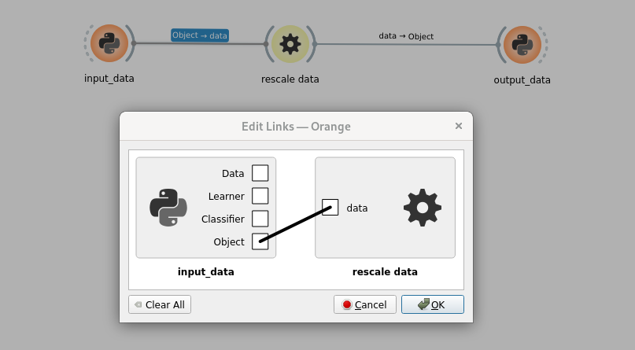
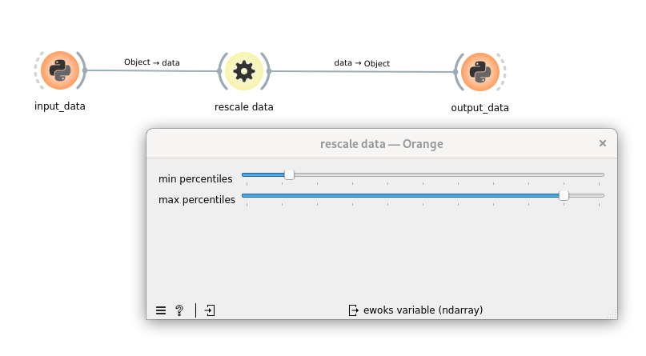

.. _tuto_first_widget_how_to_get_input_from_gui:

How to get input from GUI
=========================

We saw previously how to :ref:`tuto_first_widget_input_gui_read_only`. Now we want to go further and let the user provide input directly from the GUI.

So first we need to update the widget to allow user editing it:

.. code-block:: text

    diff --git a/src/orangecontrib/testtuto/ClipDataOW.py b/src/orangecontrib/testtuto/ClipDataOW.py
    index e52788b..821428c 100644
    --- a/src/orangecontrib/testtuto/ClipDataOW.py
    +++ b/src/orangecontrib/testtuto/ClipDataOW.py
    @@ -61,7 +61,6 @@ class MyWidget(qt.QWidget):
    
            self._minPercentiles = qt.QSlider(qt.Qt.Orientation.Horizontal)
            self._minPercentiles.setTickPosition(qt.QSlider.TickPosition.TicksBelow)
    -        self._minPercentiles.setEnabled(False)
            self._minPercentiles.setRange(0, 100)
            self._minPercentiles.setTickInterval(10)
            self.layout().addRow(
    @@ -72,7 +71,6 @@ class MyWidget(qt.QWidget):
            # max percentiles
            self._maxPercentiles = qt.QSlider(qt.Qt.Orientation.Horizontal)
            self._maxPercentiles.setTickPosition(qt.QSlider.TickPosition.TicksBelow)
    -        self._maxPercentiles.setEnabled(False)
            self._maxPercentiles.setRange(0, 100)
            self._maxPercentiles.setTickInterval(10)
            self.layout().addRow(

And then we can connect the QSlider `valueChanged` signal to keep the ewoks input up to date

.. code-block:: python
    :linenos:

    class ClipDataOW(
        OWEwoksWidgetOneThread,
        ewokstaskclass=ClipDataTask,
    ):
        name = "rescale data"
        id = "orange.widgets.my_project.ClipDataTask"
        description = "widget to clip data (numpy array) within a percentile range."
        want_main_area = True
        want_control_area = False

        def __init__(self, parent=None):
            super().__init__(parent)

            self._myWidget = MyWidget(self)
            self.mainArea.layout().addWidget(self._myWidget)
            # connect signal / slot
            self._myWidget._minPercentiles.valueChanged.connect(self._percentileChanged)
            self._myWidget._maxPercentiles.valueChanged.connect(self._percentileChanged)            

        def handleNewSignals(self):
            percentiles = self.get_task_input_value("percentiles")
            if not is_missing_data(percentiles):
                self._myWidget.setPercentiles(percentiles)
            return super().handleNewSignals()

        def _percentileChanged(self):
            self.set_dynamic_input("percentiles", self._myWidget.getPercentiles())

.. hint::

    * l17-18\: connect the sliders to the `_percentileChanged` callback function
    * l26-27\: when one of the input value change we can update on the fly the input of the ewoks tasks. For this we can use two functions\:

        * `set_dynamic_input`\: will only define the input of ewoks on the fly
        * `set_default_input`\: will define ewoks input on the fly **and** update orange settings. So this value will be saved within the .ows file. To be used carefully, especially if some input can be heavy.

Sometime it can be 'counterintuitive' to the user to be able to provide an input from both a link and a GUI.
In this case you can hide the input from the link by using the `_ewoks_inputs_to_hide_from_orange` class attribute. This will hide the defined inputs from the 'links' interface.

.. code-block:: python

    class ClipDataOW(
        OWEwoksWidgetOneThread,
        ewokstaskclass=ClipDataTask,
    ):
        ...
        _ewoks_inputs_to_hide_from_orange = ("percentiles", )

And we can also remove update of the QSlider when receiving a 'percentiles' inputs (as this is now fully defined by the GUI).
And only initialize it in the constructor.

.. code-block:: python

    class ClipDataOW(
        OWEwoksWidgetOneThread,
        ewokstaskclass=ClipDataTask,
    ):
        name = "rescale data"
        id = "orange.widgets.my_project.ClipDataTask"
        description = "widget to clip data (numpy array) within a percentile range."
        want_main_area = True
        want_control_area = False

        _ewoks_inputs_to_hide_from_orange = ("percentiles", )

        def __init__(self, parent=None):
            super().__init__(parent)

            self._myWidget = MyWidget(self)
            self.mainArea.layout().addWidget(self._myWidget)

            # set up percentiles
            self._myWidget.setPercentiles((10, 90))

            # connect signal / slot
            self._myWidget._minPercentiles.valueChanged.connect(self._percentileChanged)
            self._myWidget._maxPercentiles.valueChanged.connect(self._percentileChanged)

        def _percentileChanged(self):
            self.set_dynamic_input("percentiles", self._myWidget.getPercentiles())
            self.execute_ewoks_task()

Now the python widget 'input_percentiles' can be removed as it has been replace by the GUI.

.. note:: the `setPercentiles` function will not automatically call 'valueChanged' of the QSlider. So to have `percentiles` input defined automatically you can either call `_percentileChanged` in the constructor or update the `setPercentiles` function.

.. hint:: to make sure the input are propagated you can add a print of the inputs in the EwoksTask (ClipDataTask)

.. warning:: You have to be careful when triggering the processing. You might not want to launch the processing each time one input is updated. Especially if the processing is very time consuming. But maybe when one particular input is changed.
