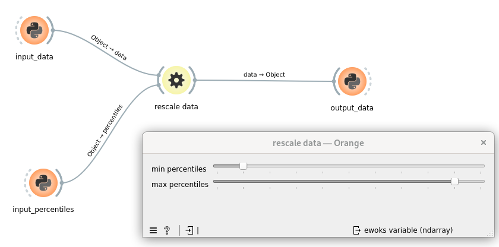

.. _tuto_first_widget_input_gui_read_only:

Add user feedback on task input(s)
==================================

Now we want to display the input value of the two percentiles from the GUI

For this we want to use the two user friendly sliders using `QSlider <https://doc.qt.io/qt-6/qslider.html>`_ (one for each percentiles)

The behavior will be the following:

* when the 'percentiles' inputs arrive it will update the sliders
* when the data arrives it will execute the task and provide 'data' to the next widget

First we will create a dedicated widget to display the inputs.

.. code-block:: python
    :linenos:

    from silx.gui import qt

    class MyWidget(qt.QWidget):
        def __init__(self, parent):
            super().__init__(parent)
            self.setLayout(qt.QFormLayout())

            self._minPercentiles = qt.QSlider(qt.Qt.Orientation.Horizontal)
            self._minPercentiles.setTickPosition(qt.QSlider.TickPosition.TicksBelow)
            self._minPercentiles.setEnabled(False)
            self._minPercentiles.setRange(0, 100)
            self._minPercentiles.setTickInterval(10)
            self.layout().addRow(
                "min percentiles",
                self._minPercentiles,
            )

            # max percentiles
            self._maxPercentiles = qt.QSlider(qt.Qt.Orientation.Horizontal)
            self._maxPercentiles.setTickPosition(qt.QSlider.TickPosition.TicksBelow)
            self._maxPercentiles.setEnabled(False)
            self._maxPercentiles.setRange(0, 100)
            self._maxPercentiles.setTickInterval(10)
            self.layout().addRow(
                "max percentiles",
                self._maxPercentiles,
            )

        def setPercentiles(self, percentiles: tuple):
            self._minPercentiles.setValue(percentiles[0])
            self._maxPercentiles.setValue(percentiles[1])

        def getPercentiles(self) -> tuple:
            return (
                self._minPercentiles.value(), self._maxPercentiles.value()
            )

.. hint::

    * l10\: At the moment we only want to provide feedback tot the users and not let them define this value

Then we can link it to the ewoksorange widget

.. code-block:: python
    :linenos:

    from ewokscore.missing_data import is_missing_data

    class ClipDataOW(
        OWEwoksWidgetOneThread,
        ewokstaskclass=ClipDataTask,
    ):
        # ...
        want_main_area = True
        want_control_area = False

        def __init__(self, parent=None):
            super().__init__(parent)

            self._myWidget = MyWidget(self)
            self.mainArea.layout().addWidget(self._myWidget)
        
        def handleNewSignals(self):
            percentiles = self.get_task_input_value("percentiles")
            if not is_missing_data(percentiles):
                self._myWidget.setPercentiles(percentiles)
            return super().handleNewSignals()

.. hint::

    * l8-9\: orange already defines a QDialog in each widget. Those dialog are separated in two - the control ant the main area. For this widget we only care about the main area
    * l14-15\: append the widget to the orange widget.
    * l17\: when ewoks receives a new signal (when we press run on the python widget for example) it will trigger this function.
    * l18-20\: we can retrieve the task inputs from 'get_task_input_value'. If the input is not defined then the condition l19 will be false. So we will only update the GUI when percentiles are defined.
    * l19\: call parent 'handleNewSignals()' to resume casual processing. Then the task can be executed and output propagated.

Then once you will reprocess your workflow you should have:

