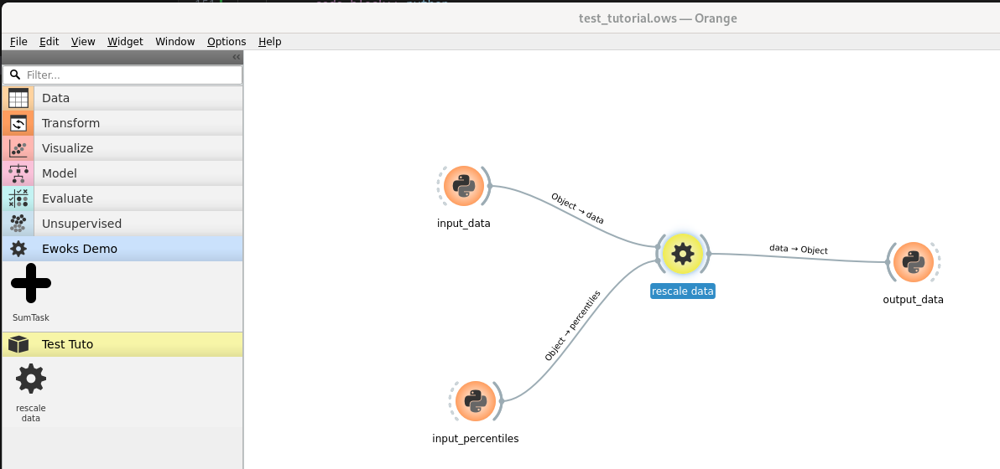

.. _tuto_first_widget_testing:

How to test this first widget ?
===============================

In this chapter we will:

* how to do simple test of a new orangecontrib widget

Including the code in an orangecontrib section
----------------------------------------------

Orange offers a mechanism to include widget(s) to the orange canvas.

Too benefit of it your library must contain a 'orangecontrib' module. See :ref:`Starting a new project from scratch` chapter.

If your project is correctly configured you should now perceive the widget we are building:

.. image:: img/first_discovery.png

.. note:: in this example we have an empty project with orange installed. The `ClipDataOW` has been added in a `Test Tuto` orangecontrib.

.. hint:: 

    `ewoks-canvas` is automatically launching the widget discovery. If you are using orange-canvas instead you might need to use the `--force-discovery` option.

.. warning::

    each Orange widget should be in a dedicated file. Else orange parsing will fail.

Test it with 'Orange3 python script' widget
-------------------------------------------

`Orange3 <https://orangedatamining.com/>`_ package offers the 'python script' widget which are very convenient for testing.

Make sure you have Orange3 installed:

.. code:: bash

    pip install Orange3

Create a workflow for testing a task
^^^^^^^^^^^^^^^^^^^^^^^^^^^^^^^^^^^^

Then you will be able to create a workflow like

In this example the
* 'rescale data' is the task you just created.
* The three other tasks / widgets are instances of `python script <https://orangedatamining.com/widget-catalog/transform/pythonscript/>`_ from `Orange3 <https://orangedatamining.com/>`_

.. hint::
    the pythonscript widget is now part of the **transform** category but it might also be in the 'data' category according to the version you are using.

.. warning::

    Link should use the **Object** input / output. Other types are Orange specific object that we don't need here.

    .. image:: img/python_script_linking.png

Providing input and output
^^^^^^^^^^^^^^^^^^^^^^^^^^

Now we can provide the task inputs from the two widgets 'input_data' and 'input_percentiles' and print the output data from `output_data` widget.
Here is the source code we will used in each of the widgets:

.. tab-set::

    .. tab-item:: `input_data` widget

        .. code-block:: python
            
            import numpy
            # generate a numpy array with values between 0.0 to 1.0
            out_object = numpy.random.random(size=10000).reshape(100, 100)
            print("input data min is", out_object.min())
            print("input data max is", out_object.max())

    .. tab-item:: `input_percentiles` widget

        .. code-block:: python

            out_object = (10, 90)

    .. tab-item:: `output_data` widget

        .. code-block:: python

            print("output data min is", in_object.min())
            print("output data max is", in_object.max())

when running the first two python widget we get:

.. code-block:: bash

    Running script:
    output data min is 0.10002332932732391
    output data max is 0.9068068838817003

If you have a close result then you can move to the next section.

Further reading
---------------

:ref:`tuto_first_widget_input_gui_read_only`
