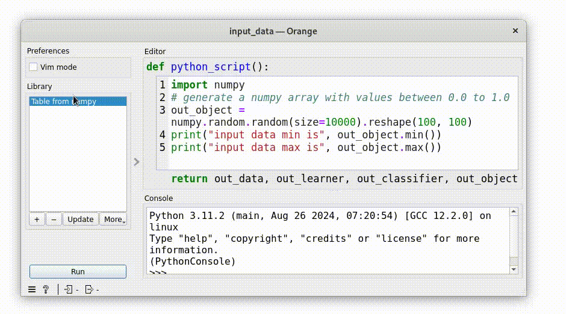

.. _tuto_first_waiting_for_validation:

Going further: waiting for a user validation
============================================

In this chapter we will:

* avoid downstream propagation until a 'ok' button is pressed
* add a 'ok' button which trigger downstrean processing with the current result

Avoid downstream propagation
----------------------------

To avoid downstream processing we can replace ewoks execution calls from `execute_ewoks_task` to `execute_ewoks_task_without_propagation`.

We also need to reimplement the `handleNewSignals` function that will call by default the `execute_ewoks_task` instead of `execute_ewoks_task_without_propagation`

.. code-block:: python

    class ClipDataOW(
        OWEwoksWidgetOneThread,
        ewokstaskclass=ClipDataTask,
    ):
        ...
        def _percentileChanged(self):
            self.set_dynamic_input("percentiles", self._myWidget.getPercentiles())
            data = self.get_task_output_value("data")
            if not is_missing_data(data):
                self.execute_ewoks_task_without_propagation()
        
        def handleNewSignals(self):
            self.execute_ewoks_task_without_propagation()

Add a ok button that triggers downstream processing
---------------------------------------------------

for this we will take the shortest way to do it:

* append a QPushButton to the control widget `MyWidget`
* connect the `released` signal to the ewoks orange function `trigger_downstream`

.. code-block:: python

    class MyWidget(qt.QWidget):
        def __init__(self, parent):
            ...

            # ok button
            self._okButton = qt.QPushButton("ok", self)
            self.layout().addRow(self._okButton)
    
    class ClipDataOW(
        OWEwoksWidgetOneThread,
        ewokstaskclass=ClipDataTask,
    ):
        def __init__(self, parent):
            ...
            # connect signal / slot
            ...
            self._myWidget._okButton.released.connect(self.trigger_downstream)

Now your workflow should look like:

.. warning:: be careful that in this use case you don;t have 'angle mort': at some point some (mandatory) input might not be defined abd this can be confusing to the user.

.. admonition:: Results
    :class: dropdown

    .. include:: materials/waiting_for_user_validation.py
        :literal:
